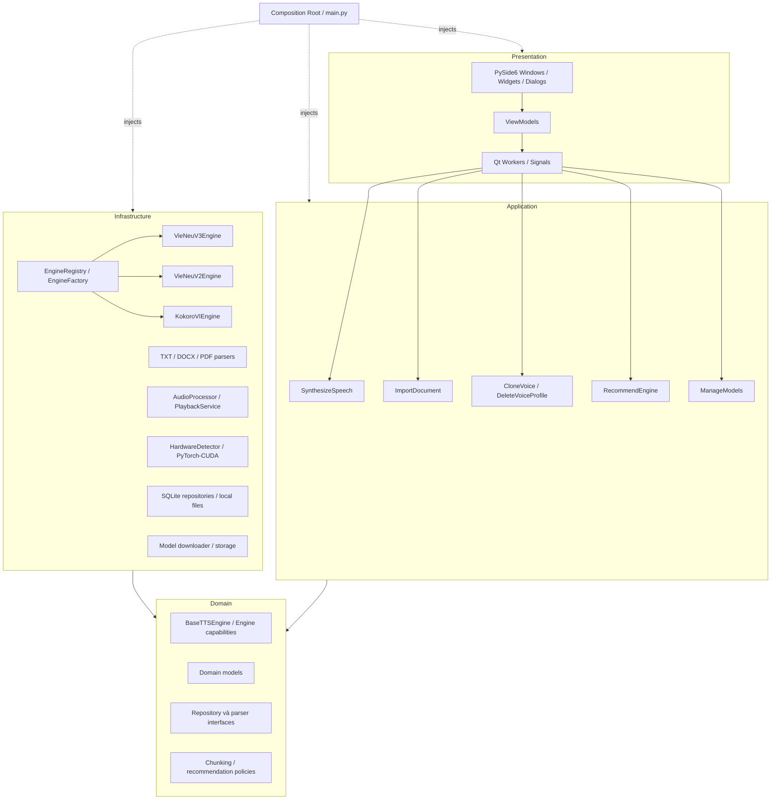
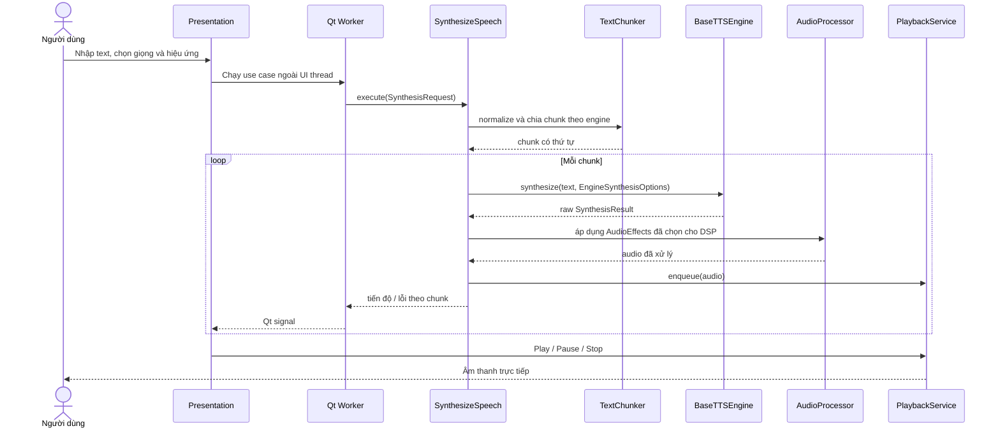

# Kiến trúc ứng dụng TTS Desktop Offline Tiếng Việt

## 1. Mục tiêu và trạng thái

Tài liệu mô tả kiến trúc của ứng dụng desktop TTS tiếng Việt hoạt động offline sau khi model đã được tải. **Giai đoạn 1 — Khung ứng dụng MVP đã được triển khai** với fake engine, cấu hình, logging, worker nền và UI cơ bản; các adapter/model thật vẫn thuộc các giai đoạn tiếp theo.

Mục tiêu kiến trúc:

- Tách giao diện Qt khỏi nghiệp vụ thuần Python.
- Cô lập SDK VieNeu, Kokoro, PyMuPDF, sounddevice, SQLAlchemy và PyTorch trong Infrastructure.
- Thay engine, backend, database hoặc playback implementation mà không sửa use case và UI.
- Chạy tác vụ nặng ngoài UI thread.
- Hoạt động offline trong sử dụng hằng ngày và giữ dữ liệu giọng hoàn toàn cục bộ.
- Chỉ bật capability sau khi adapter/runtime tương ứng xác nhận hỗ trợ.

## 2. Kiến trúc bốn nhóm trách nhiệm



### Quy tắc phụ thuộc

1. **Presentation** chỉ gọi use case của Application. Không import trực tiếp SDK TTS, SQLite/SQLAlchemy, PyMuPDF hoặc sounddevice.
2. **Application** điều phối contract Domain và các port được inject. Không import widget, signal hoặc event loop PySide6.
3. **Domain** chỉ chứa contract, value object, policy và exception thuần Python. Không phụ thuộc PySide6, SQLAlchemy, PyTorch, VieNeu, Kokoro, PyMuPDF hoặc sounddevice.
4. **Infrastructure** triển khai contract Domain và chứa mọi tích hợp framework/SDK/I/O cụ thể.
5. `main.py` là composition root: tạo implementation, inject dependency và khởi động UI. Nó không chứa nghiệp vụ.
6. Dependency được truyền qua constructor. Test Application/Domain dùng fake hoặc mock, không cần Qt, model thật, database thật hay thiết bị âm thanh.

## 3. Trách nhiệm của từng lớp

### 3.1. Presentation

| Thành phần | Trách nhiệm |
|---|---|
| Window, widget, dialog | Nhận thao tác người dùng, render state, validate định dạng nhập cơ bản và hiển thị lỗi/tiến độ. |
| ViewModel | Chuyển ý định UI thành lời gọi use case, giữ state trình bày và bật/tắt tính năng theo `EngineCapabilities`. |
| `presentation/workers/` | Chạy use case ngoài UI thread, gửi tiến độ/kết quả/lỗi và nhận yêu cầu hủy. |
| Qt signal | Truyền sự kiện an toàn về UI thread; không mang SDK object ra UI. |

Worker sử dụng `QRunnable`, `QThreadPool` hoặc Qt signal **chỉ** nằm trong `presentation/workers/`. Worker không tự thực hiện TTS, parse, DSP hoặc truy cập database; nó chỉ bao use case. Business logic không phụ thuộc event loop Qt.

### 3.2. Application

| Use case | Trách nhiệm |
|---|---|
| `SynthesizeSpeech` | Validate request nghiệp vụ, normalize/chunk text, chọn kế hoạch native/DSP duy nhất, gọi engine, xử lý audio và chuyển kết quả tới playback. |
| `ImportDocument` | Chọn parser theo loại tệp, trả `ParsedDocument` và cảnh báo; không cập nhật UI. |
| `CloneVoice` | Kiểm tra capability và quy tắc mẫu của engine, gọi adapter, lưu hồ sơ gắn với `engine_id`. |
| `DeleteVoiceProfile` | Xóa metadata và tệp mẫu/profile liên quan theo một quy trình nhất quán, có xử lý lỗi từng phần. |
| `RecommendEngine` | Nhận `HardwareInfo`, áp dụng policy/ngưỡng cấu hình và trả khuyến nghị kèm lý do; không ép lựa chọn. |
| `ManageModels` | Liệt kê, tải có xác nhận, kiểm tra checksum, phát hiện thiếu/hỏng, hủy tải và xóa model. |

Application điều phối transaction và thứ tự thao tác nhưng không chứa code phụ thuộc PySide6 hay chi tiết SDK.

### 3.3. Domain

Domain chứa:

- Contract `BaseTTSEngine`, repository và document parser.
- `EngineCapabilities`, `EngineInfo`, `VoiceInfo`, `HardwareInfo`.
- `SynthesisRequest`, `EngineSynthesisOptions`, `AudioEffects`, `SynthesisResult`.
- `VoiceProfile`, `ParsedDocument` và metadata model.
- Policy chunking, recommendation và các exception cấp ứng dụng.

Các model Domain không chứa `QObject`, SQLAlchemy model hoặc kiểu riêng của SDK.

### 3.4. Infrastructure

| Thành phần | Trách nhiệm |
|---|---|
| `VieNeuV3Engine` | Adapter VieNeu-TTS v3-Turbo/PyTorch; chuyển kiểu dữ liệu, lifecycle và lỗi SDK về contract chung. |
| `VieNeuV2Engine` | Adapter VieNeu-TTS v2-Turbo, gồm backend GGUF khi implementation tương ứng khả dụng. |
| `KokoroVIEngine` | Adapter Kokoro-Vietnamese, liệt kê voicepack có sẵn và khai báo `voice_cloning=False`. |
| Parser TXT/DOCX/PDF | Đọc I/O cụ thể, xử lý encoding/thư viện và trả `ParsedDocument`. |
| `AudioProcessor` | Thực thi DSP speed/pitch/volume theo kế hoạch đã chọn, chuẩn hóa sample rate/format. |
| `PlaybackService` | Quản lý Play/Pause/Stop và queue phát qua sounddevice. |
| `HardwareDetector` | Thu thập CPU, RAM, GPU/CUDA thành `HardwareInfo`, không tự chọn engine. |
| Persistence | Triển khai repository bằng SQLite/SQLAlchemy và quản lý tệp cục bộ. |
| Model management | Download, checksum, lưu trữ, phát hiện thiếu/hỏng và xóa model. Đây là vùng duy nhất được phép truy cập mạng theo yêu cầu người dùng. |

## 4. Pattern và lý do lựa chọn

- **Adapter:** cô lập API/kiểu dữ liệu/exception của từng engine sau `BaseTTSEngine`.
- **Registry:** cung cấp danh mục engine và metadata/capability thống nhất, không khởi tạo dựa trên phần cứng.
- **Factory:** tạo hoặc trả instance theo `engine_id`, quản lý lifecycle nhưng không đánh giá cấu hình máy.
- **Strategy/Policy:** thay đổi quy tắc recommendation, chunking và lựa chọn native DSP bằng cấu hình/test độc lập.
- **Worker Thread:** giữ UI responsive khi tổng hợp, đọc tệp lớn, DSP hoặc tải model.
- **Repository:** tách Domain/Application khỏi SQLite và filesystem.
- **Constructor injection:** làm rõ dependency và cho phép kiểm thử bằng fake/mock.

## 5. Hợp đồng engine và model nghiệp vụ

Các kiểu dưới đây thuộc `domain/`. Implementation SDK chỉ được chuyển đổi sang/đi từ các kiểu này bên trong adapter.

```python
from abc import ABC, abstractmethod
from dataclasses import dataclass
from datetime import datetime


@dataclass(frozen=True)
class EngineCapabilities:
    voice_cloning: bool
    native_speed_control: bool
    native_pitch_control: bool
    streaming: bool
    cpu_supported: bool
    gpu_supported: bool


@dataclass(frozen=True)
class EngineSynthesisOptions:
    voice_id: str
    reference_audio_path: str | None = None


@dataclass(frozen=True)
class AudioEffects:
    speed: float = 1.0
    pitch_semitones: float = 0.0
    volume_db: float = 0.0


@dataclass(frozen=True)
class VoiceProfile:
    id: str
    name: str
    engine_id: str
    reference_audio_path: str
    created_at: datetime


class BaseTTSEngine(ABC):
    @property
    @abstractmethod
    def engine_info(self) -> EngineInfo:
        ...

    @property
    @abstractmethod
    def capabilities(self) -> EngineCapabilities:
        ...

    @abstractmethod
    def load(self, device: str) -> None:
        ...

    @abstractmethod
    def unload(self) -> None:
        ...

    @abstractmethod
    def is_loaded(self) -> bool:
        ...

    @abstractmethod
    def list_voices(self) -> list[VoiceInfo]:
        ...

    @abstractmethod
    def synthesize(
        self,
        text: str,
        options: EngineSynthesisOptions,
    ) -> SynthesisResult:
        ...

```

Giai đoạn 1 chưa thêm `clone_voice()` vì chưa có workflow/hồ sơ giọng hoàn chỉnh. Capability `voice_cloning` vẫn có trong contract để UI khóa chức năng. Khi Giai đoạn 6 bổ sung `clone_voice()`, method phải trả lỗi capability cấp Domain nếu bị gọi trên engine không hỗ trợ; tuyệt đối không fake/fallback cloning.

`EngineInfo`, `VoiceInfo`, `HardwareInfo`, `SynthesisRequest` và `SynthesisResult` được chốt field chi tiết trong Giai đoạn 1 dựa trên dữ liệu chung thực tế của ba adapter. SDK object không được dùng trực tiếp làm các model này.

## 6. Pipeline tổng hợp và DSP

Pipeline mặc định:

```text
Text
→ Text normalization
→ Text chunking
→ TTS engine
→ Raw audio
→ Audio processor
→ Playback queue
```



### Không áp dụng hiệu ứng hai lần

- `EngineSynthesisOptions` chỉ chứa lựa chọn giọng và mẫu tham chiếu; `AudioEffects` là yêu cầu hiệu ứng độc lập.
- Với contract MVP này, speed/pitch/volume được áp dụng **một lần** trong `AudioProcessor`; native speed/pitch chưa được bật dù capability có thể báo hỗ trợ.
- Nếu kiểm thử tích hợp chứng minh native control có lợi, policy phải chọn đúng một đường: native **hoặc** hậu xử lý. Trước khi bật native, contract options phải được mở rộng rõ ràng để truyền giá trị đã chọn; phần hiệu ứng tương ứng phải được đặt về neutral/bỏ qua ở `AudioProcessor`.
- Không được vừa truyền cùng speed/pitch vào engine vừa áp dụng lại trong DSP.
- Cần so sánh chất lượng, phạm vi giá trị và tính ổn định của native control với DSP trong giai đoạn tích hợp audio trước khi đổi policy mặc định.

## 7. Registry, Factory và Recommendation

| Thành phần | Có trách nhiệm | Không có trách nhiệm |
|---|---|---|
| `EngineRegistry` | Quản lý adapter đã đăng ký; cung cấp `EngineInfo` và capability. | Không phát hiện phần cứng, không tự tải model. |
| `EngineFactory` | Tạo/trả engine theo `engine_id`; phối hợp load/unload lifecycle. | Không chứa ngưỡng CPU/RAM/VRAM và không chọn thay người dùng. |
| `EngineRecommendationService` | Nhận `HardwareInfo`, áp dụng policy và trả engine đề xuất cùng lý do. | Không tự khởi tạo, tải hoặc ép chuyển engine. |

Ngưỡng phần cứng nằm trong file cấu hình/policy riêng, không hard-code trong UI. Giá trị ban đầu được hiệu chỉnh trên máy mục tiêu và có thể thay đổi mà không sửa UI. Lựa chọn thủ công được lưu riêng với khuyến nghị để UI có thể giải thích cả hai.

## 8. Model Manager

`ManageModels` điều phối model catalog, downloader và storage để quản lý:

- `model_id`, engine liên quan, phiên bản, license/nguồn.
- Trạng thái đã tải, phiên bản và đường dẫn lưu.
- Kích thước model và dung lượng đĩa cần thiết.
- Trạng thái/tiến độ tải và hủy tải an toàn.
- Checksum, phát hiện tệp thiếu hoặc hỏng.
- Xóa model và xử lý model đang được engine sử dụng.

Quy tắc:

- Không tự động tải khi chưa có xác nhận người dùng.
- Model downloader là thành phần duy nhất được phép truy cập mạng, chỉ khi người dùng tải hoặc kiểm tra cập nhật.
- Tải vào tệp tạm, kiểm tra checksum rồi mới chuyển thành model khả dụng; không coi tải dở là hợp lệ.
- Không xóa model đang load; yêu cầu unload hoặc báo lỗi rõ ràng.
- Manifest, URL/nguồn chính thức, checksum, license, layout và cơ chế version phải được xác định khi tích hợp từng model.

## 9. Voice Cloning và dữ liệu cục bộ

- `VoiceProfile` luôn gắn với `engine_id`; profile không dùng chéo engine nếu adapter không có chuyển đổi được xác nhận.
- `CloneVoice` kiểm tra `capabilities.voice_cloning`, định dạng và thời lượng mẫu theo policy của engine.
- Mẫu và profile chỉ lưu cục bộ, không upload và không ghi nội dung nhạy cảm vào log.
- `DeleteVoiceProfile` xóa metadata và tệp liên quan, đồng thời báo rõ nếu chỉ xóa được một phần.
- UI khóa toàn bộ chức năng khi engine không hỗ trợ.
- Kokoro-Vietnamese không có zero-shot Voice Cloning; không triển khai giả lập hoặc fallback.
- API, backend GPU/PyTorch, định dạng và khoảng thời lượng mẫu của VieNeu-TTS v3-Turbo/v2-Turbo phải được xác minh khi tích hợp adapter.

## 10. Nhập tài liệu, chunking và playback

### Parser

Mỗi định dạng có adapter riêng và trả cùng model:

```python
@dataclass(frozen=True)
class ParsedDocument:
    text: str
    source_path: str
    page_count: int | None = None
    warnings: tuple[str, ...] = ()
```

- TXT xử lý encoding; DOCX dùng python-docx; PDF dùng PyMuPDF.
- Bản đầu chỉ hỗ trợ PDF có lớp văn bản. PDF scan/PDF ảnh trả cảnh báo không hỗ trợ; chưa có OCR.
- Tệp lớn chạy qua Qt worker nhưng parser không biết hoặc cập nhật UI.

### Chunking

`TextChunker` nhận policy theo engine: ưu tiên đoạn, sau đó câu, cuối cùng mới cắt theo ký tự; giữ thứ tự và dấu câu. Kích thước cấu hình theo engine, ghi lỗi theo chunk và cho phép hủy an toàn giữa các chunk. Giới hạn mặc định được hiệu chỉnh bằng kiểm thử văn bản dài khi tích hợp từng engine.

### Playback MVP

Phạm vi bắt buộc là tổng hợp → DSP → `PlaybackService` → Play/Pause/Stop, kèm cancellation và queue cơ bản. Phát từng chunk ngay khi hoàn thành là tối ưu sau, không phải điều kiện hoàn thành MVP đầu tiên. Không có chức năng xuất WAV/MP3 trong MVP; `data/cache/` chỉ là cache nội bộ.

## 11. Cấu trúc thư mục đích

### 11.1. Cấu trúc đã triển khai trong Giai đoạn 1

```text
src/vntts/
├── __init__.py
├── __main__.py
├── main.py
├── presentation/
│   ├── main_window.py
│   ├── viewmodels/
│   ├── widgets/
│   ├── workers/
│   └── resources/
├── application/
│   ├── services/
│   └── use_cases/
├── domain/
│   ├── tts/
│   ├── hardware/
│   └── exceptions.py
├── infrastructure/
│   ├── engines/fake_engine.py
│   └── hardware/hardware_detector.py
├── config/
└── utils/

tests/
├── unit/
└── ui/
```

### 11.2. Cấu trúc mở rộng theo roadmap

Các thư mục chưa có implementation chỉ được tạo khi bước tương ứng bắt đầu; không dựng file rỗng để giả lập tính năng.

```text
vietnamese-tts-desktop/
├── README.md
├── pyproject.toml
├── requirements/
│   ├── base.txt
│   ├── vieneu-pytorch.txt
│   ├── vieneu-gguf.txt
│   └── kokoro.txt
├── src/
│   └── vntts/
│       ├── main.py
│       ├── presentation/
│       │   ├── main_window.py
│       │   ├── viewmodels/
│       │   ├── widgets/
│       │   ├── dialogs/
│       │   ├── workers/
│       │   └── resources/
│       ├── application/
│       │   ├── synthesize_speech.py
│       │   ├── import_document.py
│       │   ├── clone_voice.py
│       │   ├── delete_voice_profile.py
│       │   ├── recommend_engine.py
│       │   └── manage_models.py
│       ├── domain/
│       │   ├── tts/
│       │   ├── audio/
│       │   ├── documents/
│       │   ├── hardware/
│       │   ├── models/
│       │   └── repositories/
│       ├── infrastructure/
│       │   ├── engines/
│       │   ├── documents/
│       │   ├── audio/
│       │   ├── hardware/
│       │   ├── model_management/
│       │   └── persistence/
│       ├── config/
│       └── utils/
├── models/
├── data/
│   ├── voice_profiles/
│   ├── voice_samples/
│   ├── cache/
│   └── app.db
├── tests/
│   ├── unit/
│   ├── integration/
│   └── fixtures/
├── scripts/
└── docs/
    ├── ARCHITECTURE.md
    ├── DEVELOPMENT.md
    ├── PRODUCTION.md
    └── MODEL_COMPATIBILITY.md
```

### Giải thích từng thư mục

| Thư mục | Vai trò và nội dung được phép chứa |
|---|---|
| `requirements/` | Tách dependency chung khỏi dependency phụ thuộc backend để môi trường không phải cài mọi engine cùng lúc. |
| `src/` | Source root theo `src layout`, ngăn import nhầm mã chưa đóng gói từ thư mục dự án. |
| `src/vntts/` | Package ứng dụng; `main.py` chỉ composition root và entry point. |
| `src/vntts/presentation/` | Toàn bộ mã phụ thuộc PySide6: window, điều phối UI, signal và trạng thái trình bày. Không chứa nghiệp vụ/SDK I/O. |
| `src/vntts/presentation/viewmodels/` | State và command dành cho view; chỉ gọi Application use case. |
| `src/vntts/presentation/widgets/` | Widget tái sử dụng như nhập văn bản, thiết lập giọng và playback controls. |
| `src/vntts/presentation/dialogs/` | Dialog Voice Cloning, Model Manager và lựa chọn/cảnh báo cần tương tác người dùng. |
| `src/vntts/presentation/workers/` | Adapter Qt `QRunnable`/`QThreadPool`, signal tiến độ/kết quả/lỗi/hủy quanh use case. |
| `src/vntts/presentation/resources/` | QSS, icon và tài nguyên giao diện tĩnh; không lưu dữ liệu người dùng. |
| `src/vntts/application/` | Một module cho mỗi use case điều phối; độc lập widget và SDK cụ thể. |
| `src/vntts/domain/` | Contract, model, policy và exception nghiệp vụ thuần Python. |
| `src/vntts/domain/tts/` | `BaseTTSEngine`, `EngineInfo`, `EngineCapabilities`, `VoiceInfo`, request/result TTS và contract registry/factory khi phù hợp. |
| `src/vntts/domain/audio/` | `AudioEffects`, model audio và port xử lý/phát âm thanh. |
| `src/vntts/domain/documents/` | `ParsedDocument`, parser interface, normalization/chunking contract và policy. |
| `src/vntts/domain/hardware/` | `HardwareInfo`, recommendation result và policy/ngưỡng trừu tượng. |
| `src/vntts/domain/models/` | Metadata model tải về, trạng thái, checksum, nguồn và license; không phải trọng số model. |
| `src/vntts/domain/repositories/` | Interface repository cho hồ sơ giọng/cấu hình cần persistence. |
| `src/vntts/infrastructure/` | Implementation phụ thuộc SDK, framework, thiết bị, filesystem, database hoặc network. |
| `src/vntts/infrastructure/engines/` | Ba TTS adapter, `EngineRegistry`, `EngineFactory` và tích hợp lifecycle/backend. |
| `src/vntts/infrastructure/documents/` | Parser TXT/DOCX/PDF dùng thư viện cụ thể và chuyển lỗi sang Domain exception. |
| `src/vntts/infrastructure/audio/` | DSP implementation, resampling và `PlaybackService` dùng sounddevice. |
| `src/vntts/infrastructure/hardware/` | Phát hiện CPU/RAM/GPU/CUDA qua psutil, py-cpuinfo và PyTorch. |
| `src/vntts/infrastructure/model_management/` | Catalog, downloader có xác nhận, checksum, storage và kiểm tra model hỏng/thiếu. |
| `src/vntts/infrastructure/persistence/` | SQLAlchemy model, SQLite session và repository implementation; không để ORM object rò ra Domain. |
| `src/vntts/config/` | YAML/settings và policy có thể cấu hình như đường dẫn, ngưỡng recommendation/chunk; không hard-code rải rác trong UI. |
| `src/vntts/utils/` | Logging và tiện ích kỹ thuật thật sự dùng chung; không trở thành nơi chứa nghiệp vụ hỗn hợp. |
| `models/` | Trọng số/voicepack tải cục bộ, dung lượng lớn và phải gitignore; được Model Storage quản lý. |
| `data/` | Dữ liệu runtime cục bộ của người dùng; không đưa nội dung thật vào version control. |
| `data/voice_profiles/` | Artifact/metadata file của hồ sơ clone theo engine nếu adapter cần ngoài SQLite. |
| `data/voice_samples/` | Mẫu âm thanh tham chiếu do người dùng chọn/lưu; dữ liệu nhạy cảm, không log/upload. |
| `data/cache/` | Audio/tệp trung gian có thể tái tạo và xóa; không phải thư mục export WAV/MP3. |
| `tests/` | Toàn bộ kiểm thử tự động, tách theo mức cô lập. |
| `tests/unit/` | Test Domain/Application bằng fake/mock, không tải model hoặc cần Qt/device thật. |
| `tests/integration/` | Test adapter, SQLite, parser, audio và engine thật khi môi trường đáp ứng. |
| `tests/fixtures/` | Dữ liệu mẫu nhỏ, không nhạy cảm và có quyền sử dụng rõ ràng. |
| `scripts/` | Công cụ phát triển/đóng gói có entry point rõ; không chứa nghiệp vụ chỉ tồn tại ở script. |
| `docs/` | Tài liệu kiến trúc và ma trận tương thích model được cập nhật từ kết quả tích hợp thực tế. |

`app.db` là tệp trong `data/`, không phải thư mục. `README.md`, `pyproject.toml`, `main.py`, các requirements và tài liệu Markdown cũng là tệp nên không lặp lại trong bảng thư mục.

## 12. Cấu hình mục tiêu và chiến lược tương thích phần cứng

### Máy phát triển/kiểm thử chính

| Thành phần | Cấu hình |
|---|---|
| Hệ điều hành | Windows 64-bit, kiến trúc x64 |
| CPU | Intel Core 5 210H, 2.20 GHz |
| RAM | 16 GB |
| GPU rời | NVIDIA GeForce RTX 4050 Laptop GPU, 6 GB VRAM |
| GPU tích hợp | Intel Graphics |

Device ID và Product ID không được lưu trong tài liệu/cấu hình vì không cần cho phát hiện năng lực và có tính định danh. Dung lượng trống thay đổi theo thời gian nên Model Manager phải đo tại runtime thay vì ghi thành hằng số.

### Chính sách lựa chọn trên máy mục tiêu

1. `HardwareDetector` đọc CUDA/GPU, VRAM khả dụng, RAM và CPU tại runtime.
2. Nếu model v3 đã có, backend PyTorch/CUDA tương thích và preflight tài nguyên đạt yêu cầu cấu hình, đề xuất `VieNeu-TTS v3-Turbo`.
3. Nếu v3 không khả dụng hoặc load thất bại, giải phóng tài nguyên và đề xuất `VieNeu-TTS v2-Turbo`/GGUF.
4. Nếu backend VieNeu không phù hợp, đề xuất `Kokoro-Vietnamese` CPU-only.
5. Hiển thị lý do và yêu cầu người dùng xác nhận khi đổi/tải model; không tự động tải hoặc ép lựa chọn.

RTX 4050 6 GB không được xem là bảo đảm rằng mọi biến thể v3 đều load được. Quyết định cuối cùng dựa trên model/backend cụ thể, VRAM đang khả dụng và kết quả load có kiểm soát.

### Khả năng chạy trên máy khác

- Policy recommendation và ngưỡng tài nguyên nằm trong `config/`, không hard-code trong ViewModel.
- Capability được đọc từ adapter tại runtime; UI không suy đoán theo tên engine.
- Mọi lỗi thiếu CUDA, model, RAM/VRAM hoặc dependency được chuyển thành lỗi ứng dụng có hướng fallback.
- Người dùng có thể bỏ qua khuyến nghị và chọn engine khác; lựa chọn thủ công vẫn phải vượt qua kiểm tra tương thích tối thiểu.
- Kết quả kiểm thử tích hợp trên máy mục tiêu dùng để hiệu chỉnh mặc định, không biến cấu hình đó thành yêu cầu hệ thống bắt buộc.

## 13. Quyết định kỹ thuật và rủi ro cần kiểm tra khi tích hợp

| Nội dung | Quyết định hiện tại | Kiểm tra trong giai đoạn liên quan |
|---|---|---|
| Kokoro Voice Cloning | Không hỗ trợ zero-shot; UI luôn khóa chức năng, không fallback. | Xác nhận danh sách voicepack và chạy CPU trong Giai đoạn 2. |
| VieNeu Voice Cloning | Chỉ hiển thị khi capability adapter xác nhận. | Kiểm tra API, backend, định dạng và thời lượng mẫu trong Giai đoạn 2/6. |
| CPU/RAM/VRAM | Policy cấu hình, preflight trước load và fallback theo chuỗi v3 → v2 → Kokoro. | Hiệu chỉnh trên máy mục tiêu khi tích hợp từng adapter; không công bố cấu hình tối thiểu từ một máy duy nhất. |
| Văn bản dài | Chunk theo đoạn → câu → ký tự, giữ dấu/thứ tự. | Kiểm tra context limit, lỗi nối và hủy giữa chunk trong Giai đoạn 3. |
| DSP | MVP áp dụng speed/pitch/volume đúng một lần sau engine. | So sánh native control với DSP trong Giai đoạn 4 trước khi bật route native. |
| Offline | Chỉ Model Manager được truy cập mạng theo xác nhận. | Chạy integration test khi ngắt mạng trong Giai đoạn 2/7/8. |
| Đóng gói | PyInstaller và Nuitka đều là ứng viên. | Đánh giá native DLL, model ngoài gói và license trong Giai đoạn 8. |
| PDF | Chỉ PDF có lớp text; chưa có OCR. | Kiểm thử PDF mã hóa/font/Unicode và cảnh báo PDF scan trong Giai đoạn 3. |
| Playback | Queue cơ bản và Play/Pause/Stop; streaming nâng cao ngoài MVP đầu. | Kiểm thử device/driver và semantics pause/cancel trên Windows trong Giai đoạn 5. |

Rủi ro riêng tư được kiểm soát bằng lưu cục bộ, không upload, không log nội dung/mẫu giọng và xóa cả metadata lẫn tệp. Rủi ro model hỏng được kiểm soát bằng checksum và cập nhật nguyên tử. Rủi ro lỗi từng chunk phải được ghi kèm chỉ số chunk nhưng không ghi nguyên văn nội dung nhạy cảm.

## 14. Nguyên tắc kiểm thử và vận hành

- Unit test Domain/Application không yêu cầu Qt, network, model, database hoặc sound device thật.
- `pytest-qt` chỉ dùng cho Presentation worker, signal và state UI.
- Integration test adapter thật được đánh dấu theo backend/phần cứng và không mặc định chạy trong bộ unit test.
- Log chứa mã lỗi, engine/version và chỉ số chunk; không chứa toàn bộ văn bản, waveform hay đường dẫn nhạy cảm khi không cần thiết.
- Cache có thể xóa và tái tạo; voice sample/profile không được coi là cache.
- Đường dẫn dữ liệu đi qua cấu hình phù hợp nền tảng, không hard-code Windows trong Domain/Application.
