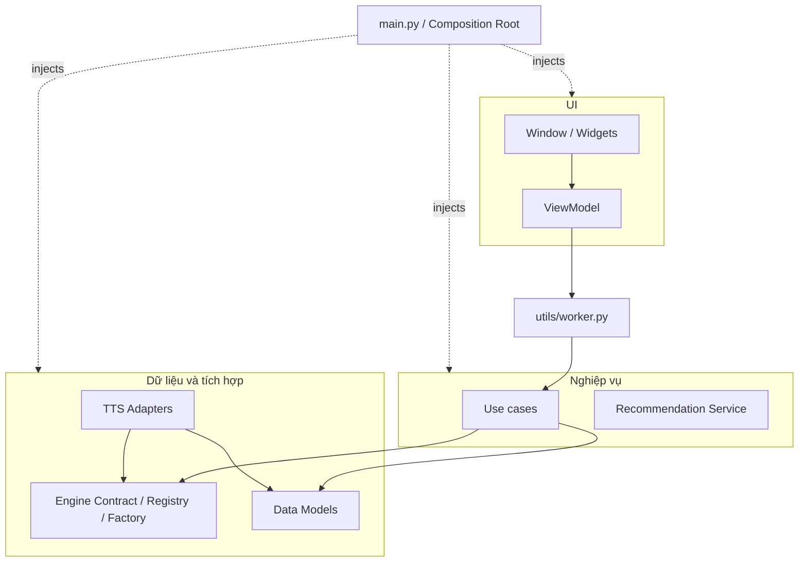
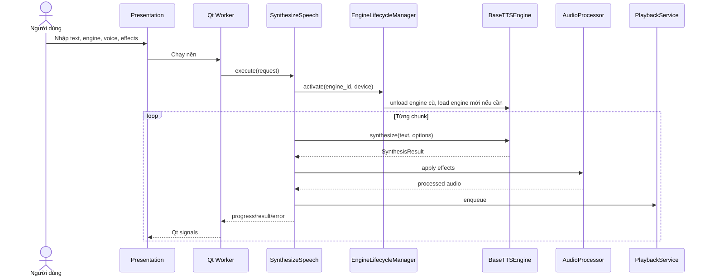

# Kiến trúc ứng dụng TTS Desktop Offline Tiếng Việt

## 1. Trạng thái và mục tiêu

Giai đoạn 2 đã hoàn thành ở mức mã nguồn và unit test: ba adapter local-only, capability runtime, registry/factory và lifecycle một-engine-active đã có. Trọng số model, integration test với SDK/model thật, DSP, playback, nhập tài liệu, Voice Cloning, persistence và Model Manager chưa được triển khai.

Mục tiêu kiến trúc:

- Tách Qt khỏi nghiệp vụ thuần Python.
- Cô lập SDK/model trong các adapter thuộc `engines/`.
- Không block UI thread.
- Hoạt động offline và giữ dữ liệu người dùng cục bộ.
- Thêm engine mới mà không sửa UI/use case.

## 2. Ba lớp trách nhiệm



Quy tắc dependency:

```text
UI → Services → Engines/DB
Engines → DB
```

- `db/` không import PySide6 hoặc SDK TTS.
- `services/` không phụ thuộc widget/event loop Qt.
- `ui/` không import trực tiếp SDK VieNeu/Kokoro.
- Adapter trong `engines/` chuyển exception SDK thành `AppError`.
- `main.py` chỉ khởi tạo/inject dependency.
- Dependency nghiệp vụ được truyền qua constructor để test bằng stub/mock.

## 3. Trách nhiệm chính

| Nhóm | Thành phần | Trách nhiệm |
|---|---|---|
| UI | `MainWindow`, widgets | Nhận input, render state, hiển thị lỗi/tiến độ. |
| UI | `MainViewModel` | Tạo request, quản lý state, gọi service qua worker. |
| Tiện ích UI | `TaskWorker` | Chạy callable bằng `QThreadPool/QRunnable`; phát signal kết quả/lỗi/hủy. |
| Nghiệp vụ | `SynthesizeSpeech` | Validate text/engine/voice, load engine khi cần và tổng hợp. |
| Nghiệp vụ | `EngineRecommendationService` | Trả khuyến nghị kèm lý do; không ép lựa chọn. |
| Dữ liệu/tích hợp | `BaseTTSEngine`, registry/factory/lifecycle | Định nghĩa contract và quản lý vòng đời adapter. |
| Dữ liệu/tích hợp | Engine adapters | Tích hợp VieNeu/Kokoro sau `BaseTTSEngine`. |
| Dữ liệu | `db.models` | Kiểu dữ liệu thuần Python dùng xuyên suốt workflow. |

Worker Qt dùng chung chỉ nằm trong `utils/worker.py`; worker không tự chứa nghiệp vụ.

Pattern sử dụng:

- **Adapter:** cô lập từng SDK sau `BaseTTSEngine`.
- **Registry/Factory:** đăng ký lazy provider và tạo engine theo ID, không load model lúc startup.
- **Worker Thread:** chạy tác vụ nặng ngoài UI thread, trả kết quả qua signal.
- **Constructor Injection:** thay dependency bằng stub/mock khi test.
- **Repository:** sẽ tách service khỏi SQLite/filesystem khi persistence được triển khai.

## 4. Contract engine

Contract Giai đoạn 2:

```python
class BaseTTSEngine(ABC):
    @property
    @abstractmethod
    def engine_info(self) -> EngineInfo: ...

    @property
    @abstractmethod
    def capabilities(self) -> EngineCapabilities: ...

    def is_available(self) -> bool: ...

    @abstractmethod
    def load(self, device: str) -> None: ...

    @abstractmethod
    def unload(self) -> None: ...

    @abstractmethod
    def is_loaded(self) -> bool: ...

    @abstractmethod
    def list_voices(self) -> list[VoiceInfo]: ...

    @abstractmethod
    def synthesize(
        self,
        text: str,
        options: EngineSynthesisOptions,
    ) -> SynthesisResult: ...
```

`is_available()` là preflight nhẹ cho SDK và asset local, không load model và không truy cập mạng. Adapter test đơn giản được mặc định `True`; adapter thật override bằng kiểm tra dependency/path.

Các model chính là frozen dataclass:

- `EngineInfo`, `EngineCapabilities`, `VoiceInfo`.
- `EngineSynthesisOptions`: `voice_id`, `reference_audio_path`.
- `AudioEffects`: speed `0.5–2.0`, pitch `-12–12`, volume dB.
- `SynthesisRequest`: text, engine ID, options, effects.
- `SynthesisResult`: NumPy array mono và sample rate dương.
- `HardwareInfo`, `EngineRecommendation`.

SDK object không được rò ra ngoài adapter. `voice_cloning` nằm trong capability để UI khóa chức năng. `clone_voice()` chỉ được thêm khi workflow/profile hoàn chỉnh.

## 5. Registry, Factory và Recommendation

| Thành phần | Làm | Không làm |
|---|---|---|
| `EngineRegistry` | Lưu provider, metadata và capability; tạo adapter theo ID. | Không load model khi liệt kê engine/capability. |
| `EngineFactory` | Gọi Registry để tạo adapter. | Không phát hiện phần cứng, chọn hoặc load model. |
| `EngineLifecycleManager` | Cache adapter nhẹ, chỉ giữ một engine loaded, unload khi đổi engine/thoát app. | Không chọn engine hoặc xử lý UI. |
| `EngineRecommendationService` | Áp dụng policy cấu hình trên `HardwareInfo`. | Không tải model hoặc ép người dùng đổi engine. |

Ngưỡng CPU/RAM/VRAM nằm trong YAML, không hard-code trong UI.

Capability Giai đoạn 2 phản ánh phần API **đã được adapter cung cấp**, không phải toàn bộ tính năng có thể tồn tại trong SDK:

| Adapter | Preset voice | CPU | CUDA | Cloning | Native speed/pitch | Streaming |
|---|---:|---:|---:|---:|---:|---:|
| `VieNeuV3Engine` | Có | Có | Có | Có, reference audio local | Không | Không |
| `VieNeuV2Engine` | Có | Có | Không | Không | Không | Không |
| `KokoroVIEngine` | Có, theo voicepack local | Có | Không | Không | Không | Không |

Adapter v3 hỗ trợ cloning tức thời bằng `reference_audio_path` local theo API v3; UI quản lý hồ sơ giọng vẫn thuộc Giai đoạn 6. V2 được cấu hình theo biến thể GGUF/CPU của sản phẩm và không mở cloning. Streaming/native speed chỉ được bật khi contract và pipeline thực sự sử dụng chúng.

## 6. Luồng tổng hợp

```text
Text → Normalize → Chunk → Engine → Raw audio → DSP → Playback queue
```



VieNeu v3 trả về raw audio thật khi SDK và model đã sẵn sàng. Playback giữ WAV PCM trong bộ nhớ và điều khiển Qt Multimedia; DSP chưa triển khai. Khi triển khai DSP, speed/pitch chỉ được xử lý **một lần**: native engine hoặc DSP, không đồng thời cả hai.

## 7. Quyết định nghiệp vụ quan trọng

### Model và offline

- Production bundle `VieNeu-TTS v3-Turbo`; chọn mặc định và load từ local path, không truy cập mạng.
- Bundle backend v3 GPU và CPU fallback theo phạm vi bản build.
- V2/Kokoro chỉ tải qua Model Manager sau xác nhận người dùng.
- Model Manager là thành phần duy nhất được truy cập mạng.
- Bundled v3 nằm trong vùng read-only của bộ cài; model tùy chọn nằm trong app-data.

Chi tiết: [MODEL_DISTRIBUTION.md](MODEL_DISTRIBUTION.md).

### Voice Cloning

- Profile luôn gắn với `engine_id` và chỉ lưu cục bộ.
- UI bật/tắt theo `EngineCapabilities` tại runtime.
- Kokoro không hỗ trợ zero-shot cloning; không fake/fallback.
- Không log hoặc upload mẫu giọng.

### Tài liệu và văn bản dài

- Parser riêng cho TXT, DOCX và PDF; cùng trả `ParsedDocument`.
- Chỉ hỗ trợ PDF có text; chưa OCR PDF scan.
- Chunk theo đoạn → câu → ký tự; giữ thứ tự và dấu câu.
- Tệp lớn, parsing, chunking và TTS chạy nền.

### Audio MVP

- Speed, pitch, volume → Play/Pause/Stop và queue cơ bản.
- Streaming nâng cao và xuất WAV/MP3 ngoài MVP đầu.
- `data/cache/` không phải thư mục export.

Ràng buộc chưa xác nhận bằng model thật: giới hạn chunk theo engine, ngưỡng CPU/RAM/VRAM, hiệu năng backend v3 GPU/CPU và workflow cloning VieNeu. Không cam kết trước khi integration test pass.

## 8. Cấu trúc thư mục

### Cây repository thực tế — Giai đoạn 2

```text
TTS/
├── .vscode/
│   └── settings.json
├── docs/
│   ├── ARCHITECTURE.md
│   ├── DEVELOPMENT.md
│   ├── MODEL_DISTRIBUTION.md
│   └── PRODUCTION.md
├── requirements/
│   ├── base.txt
│   ├── dev.txt
│   ├── kokoro.txt
│   └── vieneu.txt
├── src/
│   └── vntts/
│       ├── config/
│       │   ├── __init__.py
│       │   ├── default.yaml
│       │   └── settings.py
│       ├── db/
│       │   ├── __init__.py
│       │   └── models.py
│       ├── engines/
│       │   ├── __init__.py
│       │   ├── base.py
│       │   ├── factory.py
│       │   ├── kokoro_engine.py
│       │   └── vieneu_engine.py
│       ├── services/
│       │   ├── __init__.py
│       │   ├── hardware.py
│       │   └── synthesis.py
│       ├── ui/
│       │   ├── resources/
│       │   │   └── styles.qss
│       │   ├── __init__.py
│       │   ├── compose_view.py
│       │   ├── main_window.py
│       │   └── settings_panel.py
│       ├── utils/
│       │   ├── __init__.py
│       │   ├── exceptions.py
│       │   ├── logger.py
│       │   └── worker.py
│       ├── __init__.py
│       ├── __main__.py
│       └── main.py
├── tests/
│   ├── ui/
│   │   └── test_main_window.py
│   ├── unit/
│   │   ├── test_engine_factory.py
│   │   ├── test_engine_lifecycle_manager.py
│   │   ├── test_engine_recommendation.py
│   │   ├── test_engine_registry.py
│   │   ├── test_hardware_detector.py
│   │   ├── test_kokoro_vi_engine.py
│   │   ├── test_settings.py
│   │   ├── test_synthesize_speech.py
│   │   └── test_vieneu_engines.py
│   └── conftest.py
├── .gitignore
├── pyproject.toml
└── README.md
```

`.git/` và `.venv/` không hiển thị trong cây vì lần lượt là metadata Git và môi trường Python được tạo cục bộ. `.vscode/` đang tồn tại trên máy developer, chỉ chứa cấu hình IDE và không thuộc logic ứng dụng.

Không tạo các module roadmap rỗng. `clone_view.py`, `library_view.py`, `document_parser.py`, `audio_processor.py`, `playback.py`, `voice_cloning.py`, `model_manager.py` và `db/database.py` chỉ được thêm khi có implementation thực tế.

### Nội dung và nhiệm vụ từng file

| File/thư mục | Nội dung và nhiệm vụ |
|---|---|
| `README.md` | Điểm bắt đầu của dự án: trạng thái, cách cài đặt/chạy, liên kết tài liệu và roadmap. |
| `pyproject.toml` | Metadata package, dependency nền tảng, entry point `vntts`, package-data và cấu hình pytest. |
| `.gitignore` | Loại môi trường ảo, cache, egg-info, build, model và dữ liệu runtime khỏi Git. |
| `requirements/` | Tách dependency theo phạm vi: nền tảng (`base`), kiểm thử (`dev`) và SDK tùy chọn VieNeu/Kokoro. |
| `docs/` | Kiến trúc, hướng dẫn developer, quy trình production và chiến lược phân phối model. |
| `tests/unit/` | Kiểm tra contract, registry/factory/lifecycle, service, settings, hardware và từng adapter độc lập. |
| `tests/ui/` | Kiểm tra cửa sổ, signal, state và workflow giao diện bằng `pytest-qt`. |
| `tests/conftest.py` | Fixture/cấu hình dùng chung cho toàn bộ test suite. |
| `src/vntts/` | Package Python chính; chứa điểm khởi chạy và ba nhóm UI, nghiệp vụ, dữ liệu/tích hợp. |
| `main.py` | Composition root: đọc settings, đăng ký adapter, dựng service/ViewModel/window và chạy Qt. |
| `__main__.py` | Delegator tối thiểu để giữ lệnh `python -m vntts`; logic khởi chạy vẫn ở `main.py`. |
| `config/settings.py` | Dataclass cấu hình, merge YAML/env, chuẩn hóa path và tạo thư mục runtime. |
| `config/default.yaml` | Giá trị mặc định development/production, đường dẫn, audio, phần cứng và logging. |
| `ui/main_window.py` | Ghép layout cửa sổ chính, đổi bố cục theo breakpoint, nối signal và phản ánh trạng thái UI. |
| `ui/compose_view.py` | `MainViewModel`, engine selector, ô nhập văn bản và playback controls hiện tại. |
| `ui/settings_panel.py` | Widget chọn giọng cùng các giá trị speed/pitch/volume. |
| `ui/resources/` | Tài nguyên giao diện đóng gói cùng package; hiện chứa `styles.qss`. |
| `engines/base.py` | `BaseTTSEngine`, `EngineCapabilities` và chuẩn hóa waveform dùng chung. |
| `services/playback.py` | Giữ waveform/WAV PCM trong bộ nhớ, điều khiển Qt Multimedia và giải phóng tài nguyên. |
| `engines/factory.py` | Registry provider lazy, factory tạo adapter và lifecycle bảo đảm tối đa một model active. |
| `engines/vieneu_engine.py` | Implementation dùng chung cùng hai public adapter VieNeu v2/v3. |
| `engines/kokoro_engine.py` | Adapter Kokoro-Vietnamese local-only và quản lý voicepack. |
| `services/synthesis.py` | Use case validate request, chuẩn bị engine và thực thi synthesis. |
| `services/hardware.py` | Phát hiện CPU/RAM/GPU và policy khuyến nghị engine. |
| `db/models.py` | Dataclass/constant dữ liệu TTS, audio, voice, hardware và recommendation. |
| `utils/exceptions.py` | Hệ phân cấp exception ổn định qua các package. |
| `utils/logger.py` | Cấu hình và shutdown Loguru, không ghi payload riêng tư. |
| `utils/worker.py` | `WorkerSignals` và `TaskWorker` chạy callable ngoài UI thread. |
| Các `__init__.py` | Khai báo package và export API thuận tiện; không chứa nghiệp vụ. |

### Mở rộng theo roadmap

```text
src/vntts/
├── ui/                 # thêm clone_view.py và library_view.py khi triển khai UI tương ứng
├── services/           # thêm parser/audio/playback/cloning/model manager theo từng giai đoạn
├── engines/            # contract, registry/lifecycle và adapter cụ thể
├── db/                 # thêm database.py khi triển khai SQLite
├── config/             # YAML, settings và policy
└── utils/              # exception, logging, worker và tiện ích kỹ thuật

models/                 # chỉ dùng khi phát triển; production v3 nằm trong installer
data/                   # voice profiles/samples, cache, database
tests/                  # unit/UI/integration/fixtures
scripts/                # download/build có kiểm soát
docs/                   # tài liệu dự án
```

Nguyên tắc:

- Chỉ tạo thư mục/module khi giai đoạn tương ứng được triển khai.
- Không lưu model, cache, log hoặc dữ liệu người dùng trong Git.
- `utils/worker.py` là nơi duy nhất chứa Qt worker dùng chung.
- Trọng số model không nằm trong `services/`, `db/` hoặc mã nguồn adapter.

## 9. Kiểm thử và vận hành

- Unit test service/engine contract không cần model, database, network hoặc audio device.
- `pytest-qt` kiểm tra UI, signal và worker.
- Integration test adapter thật tách theo backend/phần cứng.
- Log chỉ chứa metadata; không chứa text, audio hoặc mẫu giọng.
- Production phải vượt qua first-run offline test trên Windows sạch, không có Hugging Face cache.

Hướng dẫn liên quan:

- [Development](DEVELOPMENT.md)
- [Production](PRODUCTION.md)
- [Phân phối model](MODEL_DISTRIBUTION.md)
