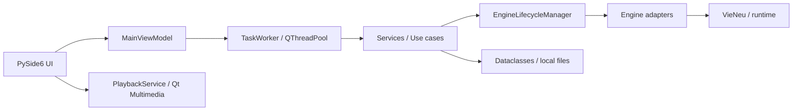
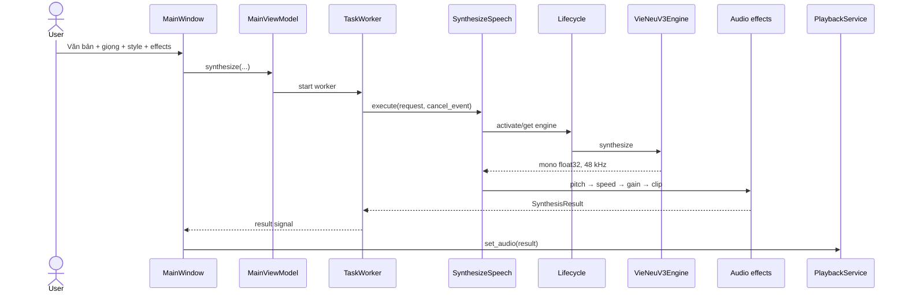
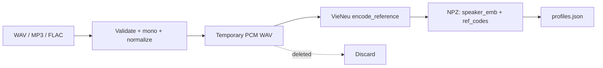

# Kiến trúc GPHI-TTS

## 1. Tổng quan

GPHI-TTS là ứng dụng desktop PySide6 theo hướng phân lớp. UI chỉ điều phối trạng thái; nghiệp vụ tổng hợp, tài liệu, audio, license và persistence nằm trong các service thuần Python; SDK TTS được cô lập sau adapter.



Quy tắc dependency chính:

```text
UI → Services → Engines / Data models
Engines → Data models
main.py → tất cả lớp để khởi tạo và inject dependency
```

## 2. Composition root và vòng đời app

`src/vntts/main.py` là composition root:

- tải `Settings` và cấu hình Loguru;
- tạo `QApplication`, font và stylesheet;
- đăng ký lazy provider `VieNeuV3Engine`;
- tạo `EngineFactory`, `EngineLifecycleManager`, `SynthesizeSpeech`;
- tạo store/enrollment, payment, license và `MainWindow`;
- lên lịch `start_initialization()` sau khi cửa sổ hiển thị;
- flush log khi app thoát.

`src/vntts/__main__.py` hỗ trợ `python -m vntts`, `multiprocessing.freeze_support()` và mutex một-instance cho frozen executable trên Windows.

## 3. Presentation

### MainWindow

`MainWindow` chứa năm trang:

| Trang | Trách nhiệm |
|---|---|
| Tạo giọng nói | Nhập văn bản/tài liệu, chọn giọng/phong cách/effect, tổng hợp, waveform, playback và export. |
| Nhân bản giọng | Chọn audio, enrollment, danh sách hồ sơ, preview, rename/delete. |
| Cài đặt | Hiển thị phần cứng/runtime và chọn Auto/GPU/CPU. |
| Thanh toán | Gửi yêu cầu mua gói và kích hoạt license. |
| Liên hệ | Hiển thị thông tin đơn vị và thông báo third-party license. |

Giao diện đổi giữa wide, compact và vertical theo kích thước cửa sổ. Các vùng dài nằm trong `QScrollArea`.

### MainViewModel và worker

`MainViewModel` quản lý state `idle`, `loading_engine`, `importing_document`, `synthesizing`, `enrolling_voice`, `cancelling` và `error`; nó không tự thực hiện tác vụ nặng. `TaskWorker` dùng `QRunnable/QThreadPool`, truyền `cancel_event` cho callable hỗ trợ và đưa kết quả/lỗi về UI bằng Qt signal.

Các tác vụ chạy nền:

- phát hiện phần cứng;
- load/reload model;
- tổng hợp và hậu xử lý;
- nhập tài liệu;
- tạo đặc trưng giọng;
- gọi API thanh toán.

## 4. Engine subsystem

`BaseTTSEngine` định nghĩa contract:

```python
engine_info
capabilities
runtime_info
is_available()
load(device)
unload()
is_loaded()
list_voices()
synthesize(text, options, cancel_event=None)
encode_voice_reference(path)  # engine hỗ trợ cloning
```

### Registry, factory và lifecycle

| Thành phần | Vai trò |
|---|---|
| `EngineRegistry` | Lưu provider, metadata và capability; liệt kê mà không tạo/load model. |
| `EngineFactory` | Tạo adapter theo `engine_id`. |
| `EngineLifecycleManager` | Cache adapter nhẹ, đảm bảo chỉ một engine loaded, hỗ trợ force reload khi đổi device. |
| `SynthesizeSpeech` | Validate request, chuẩn bị engine, thực thi tổng hợp và áp dụng audio effects. |

Composition root hiện chỉ đăng ký `vieneu-v3`. Adapter `vieneu-v2` và `kokoro-vi` vẫn được giữ như integration code có test, chưa phải tính năng người dùng.

### VieNeu v3 runtime

Capability thực tế:

| Preset voice | Clone | CPU | CUDA | Style | Native speed/pitch | Streaming |
|---:|---:|---:|---:|---:|---:|---:|
| Có | Có | ONNX | PyTorch | 3 style | Không | Không |

`auto` chọn CUDA nếu PyTorch báo khả dụng. Khi GPU initialization lỗi trong chế độ này, adapter đóng runtime lỗi, giải phóng CUDA cache và thử lại bằng CPU/ONNX. Chọn `cuda` rõ ràng thì lỗi được trả về, không fallback.

Production bundle được xác minh manifest, version SDK, size và SHA-256 trước khi runtime khởi tạo. Sau đó app cấu hình Hugging Face cache offline để SDK vẫn dùng API chuẩn nhưng không thể tải mạng.

## 5. Luồng tổng hợp



Audio effects được thực hiện một lần sau engine:

- pitch shift bằng resample + phase vocoder;
- time stretch giữ cao độ;
- volume theo gain dB;
- clip về `[-1, 1]`.

Không có chunker ở service hiện tại; toàn bộ text được chuyển cho engine trong một request. Vì vậy tài liệu không cam kết streaming hay progress theo chunk.

## 6. Playback và export

`PlaybackService` giữ `SynthesisResult`, mã hóa PCM 16-bit và WAV trong bộ nhớ. `QAudioSink` chỉ được mở khi người dùng nhấn phát. Service hỗ trợ play, pause, stop, seek, theo dõi thay đổi output device và giải phóng sink khi clear/shutdown.

- WAV: PCM mono theo sample rate của kết quả.
- MP3: mã hóa bằng `lameenc`.
- Waveform và timer lấy từ cùng result đang giữ.

## 7. Nhập tài liệu

`DocumentTextImporter` trả về `ImportedDocument` chung cho bốn parser:

- TXT: UTF-8 BOM, UTF-16 hoặc CP1258;
- SRT: bỏ index/timestamp/markup;
- DOCX: paragraph và table;
- PDF: text layer, hỗ trợ PDF không mật khẩu hoặc mật khẩu rỗng.

Không có OCR. Whitespace được chuẩn hóa nhưng thứ tự nội dung được giữ.

## 8. Voice cloning và persistence



`preprocess_reference_audio` yêu cầu tối thiểu 6 giây có tiếng, cảnh báo quá 8 giây/clipping, chuyển mono, bỏ DC offset và peak normalize. `VoiceEnrollmentService` tạo WAV tạm, gọi engine một lần, lưu feature rồi xóa file tạm trong `finally`.

`VoiceProfileStore` dùng index JSON và artifact NPZ dưới `data/voice_profiles`. Ghi index qua file `.tmp` rồi replace để giảm nguy cơ hỏng dữ liệu. Xóa profile đồng thời xóa artifact.

## 9. License và payment

### License

License có dạng `base64url(payload).base64url(signature)`. `LicenseService`:

- xác minh Ed25519 offline;
- validate schema/version/plan/date;
- so MAC với máy hiện tại;
- kiểm tra hết hạn, trừ gói `lifetime`;
- lưu nguyên key và `last_seen_time` trong `license.json`;
- từ chối khi đồng hồ lùi.

UI khóa trang tạo/clone khi license không hợp lệ và revalidate trước synthesis/enrollment.

### Payment

`PaymentService` POST JSON bằng `urllib.request` đến endpoint cấu hình. Endpoint rỗng là mock local; endpoint mặc định hiện trỏ localhost. Payment là boundary mạng duy nhất trong chức năng hiện có và tách khỏi pipeline TTS. Contract vẫn ở mức test: UI chỉ submit tháng/năm và payload dùng giá tạm cố định thay vì giá đang hiển thị.

## 10. Dữ liệu, cấu hình và logging

`load_settings()` merge safe defaults với YAML rồi áp dụng environment overrides. Directory ghi được được tạo tự động dưới app-data; model bundle nằm dưới installation root.

Loguru ghi `vntts.log`, rotation 10 MB, retention theo YAML, `enqueue=True`. Development có thêm stderr. Log chỉ ghi metadata như engine ID, độ dài text và thời gian xử lý, không ghi nội dung text.

## 11. Cấu trúc source

| Đường dẫn | Nội dung |
|---|---|
| `config/settings.py` | Load, validate, normalize YAML/env/path. |
| `config/theme.py` | Token giao diện, font và QSS. |
| `db/models.py` | Dataclass engine, voice, request/result, hardware. |
| `engines/base.py` | Contract và chuẩn hóa waveform. |
| `engines/factory.py` | Registry, factory, lifecycle. |
| `engines/vieneu_engine.py` | VieNeu v2/v3 adapters. |
| `engines/kokoro_engine.py` | Kokoro adapter chưa đăng ký. |
| `engines/model_bundle.py` | Manifest/checksum/offline cache. |
| `services/synthesis.py` | Use case và DSP. |
| `services/playback.py` | Qt audio, seek và export. |
| `services/document_import.py` | TXT/SRT/DOCX/PDF. |
| `services/audio_processor.py` | Kiểm tra mẫu clone. |
| `services/voice_enrollment.py` | Enrollment một lần. |
| `services/voice_profiles.py` | JSON/NPZ persistence. |
| `services/license_service.py` | License offline. |
| `services/payment_service.py` | Payment HTTP boundary. |
| `ui/` | Main window và các page/widget. |
| `utils/worker.py` | Worker/cancellation/signals. |
| `utils/logger.py` | Privacy-conscious logging. |

## 12. Điểm mở rộng

- Đăng ký engine mới trong composition root và cung cấp capability chính xác.
- Thêm OCR như service riêng, không đặt trong UI.
- Nếu cần văn bản rất dài/streaming, thêm chunking ở use-case và định nghĩa contract progress rõ ràng.
- Backend payment production cần sở hữu pricing và contract version; client không nên là nguồn giá tin cậy.
- Public key license production phải được inject/configure thay cho test key hard-code.
